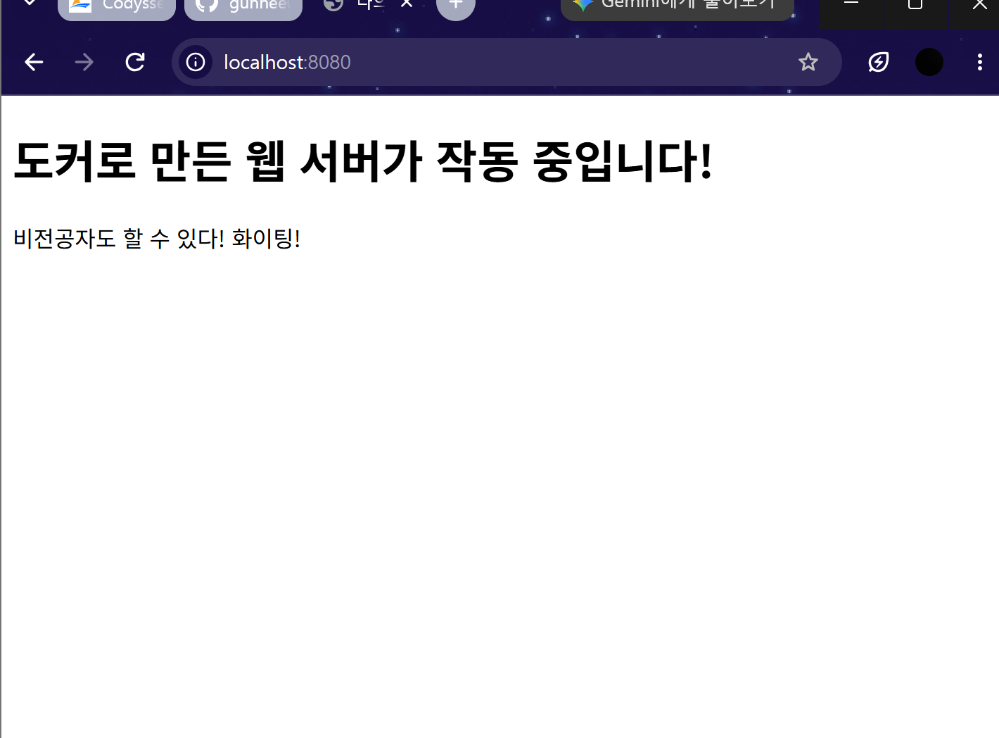
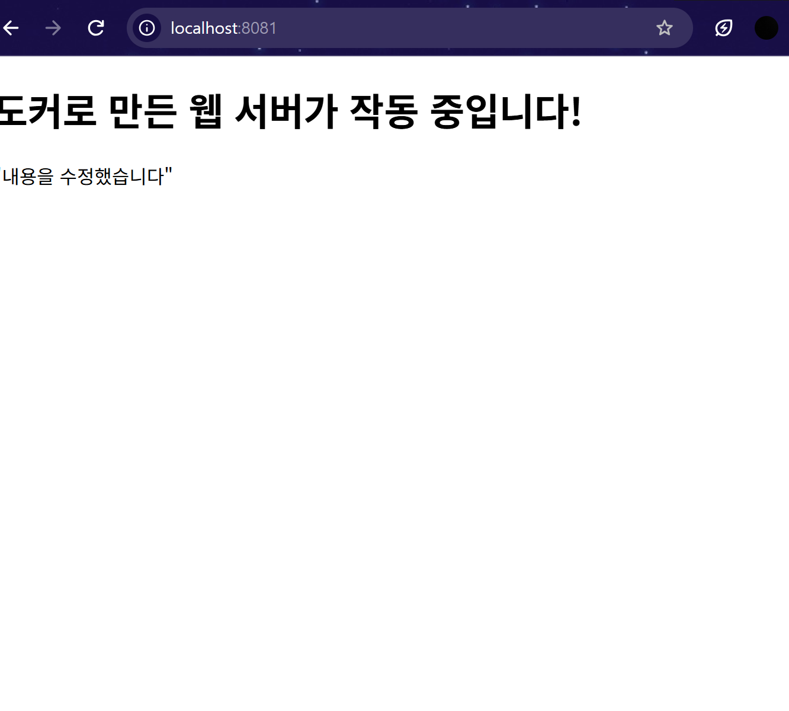
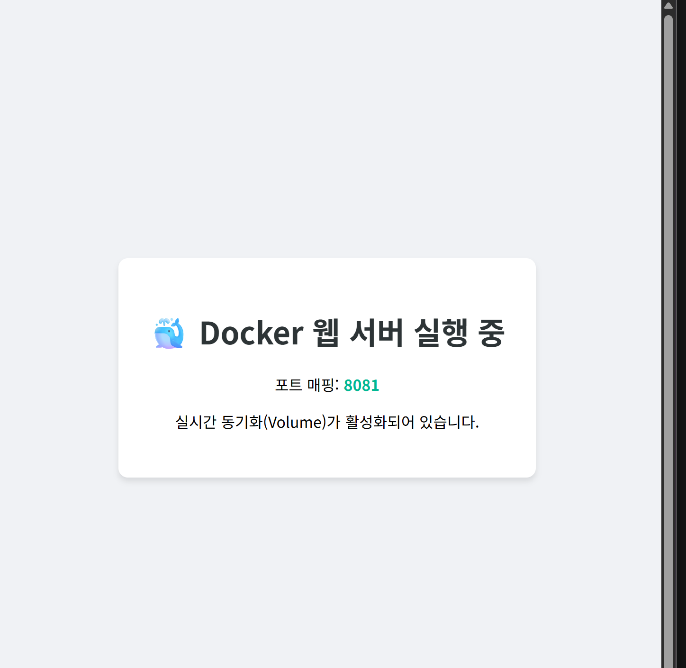

# 첫 번째 과제: 내 컴퓨터에 개발자용 작업실 꾸미기

## 1. 프로젝트 개요


이번 프로젝트에서는 Linux CLI, 파일 권한(Permission), Docker, Dockerfile, Docker Container, Bind Mount, Docker Compose, Git, GitHub를 직접 실습하며 기본적인 개발환경을 구축하였습니다.

 실제 터미널에서 실행한 명령어와 출력 결과를 가능한 한 그대로 기록하였습니다. 또한 실습 과정에서 발생한 오류와 해결 과정도 함께 기록하여, 동일한 환경에서 실습 과정을 다시 확인할 수 있도록 구성하였습니다.

---

# 2. 실행환경

| 구분 | 사용 환경 |
|---|---|
| OS | Windows 11 + WSL2 |
| Terminal | Git Bash |
| IDE | Visual Studio Code |
| Docker | Docker 29.6.2 |
| Docker Compose | Docker Compose v5.3.1 |
| Git | Git for Windows |
| Repository | GitHub |
---

# 3. 수행항목 체크리스트

- [x] 현재 작업 위치 확인 및 디렉터리 생성
- [x] 파일 생성 및 목록 확인
- [x] 파일 권한 확인
- [x] `chmod`를 이용한 파일 권한 변경
- [x] Docker 버전 확인
- [x] Docker Engine 상태 확인
- [x] `hello-world` 컨테이너 실행
- [x] Dockerfile 작성
- [x] Docker Image Build
- [x] Docker Container 실행
- [x] Port Mapping
- [x] Container 상태 확인
- [x] Container 종료 및 삭제
- [x] Bind Mount 실습
- [x] 프로젝트 전체 Bind Mount
- [x] Docker Compose 실행
- [x] Git Stage / Commit / Push
- [x] GitHub Repository 업로드

---

# 4. 디렉토리 구조

```text
## 4. 디렉터리 구조

```text
codyssey-1/
├── README.md
└── practice/
    ├── images/
    │   ├── localhost_8080.png
    │   ├── localhost_8081.png
    │   └── volume.png
    ├── Dockerfile
    ├── docker-compose.yml
    ├── index.html
    └── test.txt
```

각 파일의 역할은 다음과 같습니다.

| `README.md` | 프로젝트 및 실습 과정 기록 |
| `Dockerfile` | Nginx 기반 Docker Image 생성 |
| `docker-compose.yml` | Docker Compose 실행 설정 |
| `index.html` | Nginx에서 출력할 웹 페이지 |
| `test.txt` | Linux CLI 및 파일 권한 실습에 사용 |

---

# 5. 수행 및 검증 로그

실제 터미널에서 수행한 명령어와 출력 결과를 가능한 한 그대로 기록하였습니다.

---

## 5.1 터미널 조작 및 권한 관리

### 5.1.1 현재 작업 위치 확인 및 디렉터리 생성과 이동

먼저 현재 작업 위치를 확인한 뒤, 실습에 사용할 `practice` 디렉터리를 생성하고 해당 디렉터리로 이동하였습니다.

### 실행 명령 및 기록

```bash
pwd
mkdir practice
cd practice
```

```bash
jkhlm@□Ŵ□ MINGW64 ~/codyssey-1 (main)
$ pwd
/c/Users/jkhlm/codyssey-1

jkhlm@□Ŵ□ MINGW64 ~/codyssey-1 (main)
$ mkdir practice

jkhlm@□Ŵ□ MINGW64 ~/codyssey-1 (main)
$ cd practice
```

`pwd`는 현재 작업 중인 디렉터리의 경로를 출력합니다.

`mkdir practice`는 `practice`라는 새 디렉터리를 생성하고, `cd practice`는 생성한 디렉터리로 이동합니다.

---

### 5.1.2 파일 생성 및 목록 확인

`touch` 명령어를 이용하여 `test.txt` 파일을 생성하였습니다.

생성된 파일을 확인하기 위해 `ls -la`를 실행하였으며, 이후 파일의 상세 권한을 확인하기 위해 `ls -l test.txt`를 실행하였습니다.

### 실행 명령 및 기록

```bash
touch test.txt
ls -la
ls -l test.txt
```

```bash
jkhlm@□Ŵ□ MINGW64 ~/codyssey-1/practice (main)
$ touch test.txt

jkhlm@□Ŵ□ MINGW64 ~/codyssey-1/practice (main)
$ ls -la
total 0
drwxr-xr-x 1 jkhlm 197609 0 Aug  5 21:08 ./
drwxr-xr-x 1 jkhlm 197609 0 Aug  5 21:07 ../
-rw-r--r-- 1 jkhlm 197609 0 Aug  5 21:08 test.txt

jkhlm@□Ŵ□ MINGW64 ~/codyssey-1/practice (main)
$ ls -l test.txt
-rw-r--r-- 1 jkhlm 197609 0 Aug  5 21:08 test.txt
```

`touch`를 통해 빈 파일을 생성할 수 있으며, `ls -la`를 이용하면 현재 디렉터리의 파일과 숨김 파일을 포함한 목록을 상세하게 확인할 수 있습니다.

실행 결과에서 `test.txt`가 생성되었고 기본 권한이 `-rw-r--r--`로 설정된 것을 확인하였습니다.

---

### 5.1.3 권한 변경 실습

생성된 `test.txt`의 권한을 `chmod` 명령어를 이용하여 변경하였습니다.

### 실행 명령 및 기록

```bash
chmod 755 test.txt
```

```bash
jkhlm@□Ŵ□ MINGW64 ~/codyssey-1/practice (main)
$ chmod 755 test.txt
```

`chmod 755 test.txt`는 `test.txt`의 권한을 `755`로 변경하는 명령입니다.

이번 터미널 원본에서는 `chmod` 실행 직후 별도의 출력이 발생하지 않았습니다.

`755`는 다음과 같이 해석할 수 있습니다.

| 7 | `rwx` |
| 5 | `r-x` |
| 5 | `r-x` |

즉 오너는 읽기, 쓰기, 실행 권한을 가지고 있으며 그룹과 그 외 3자는 읽기와 실행 권한을 가집니다.

---

## 5.2 Docker 점검 및 기본 컨테이너 운용

### 5.2.1 Docker 버전 및 Engine 상태 점검

Linux CLI 실습 이후 Docker가 정상적으로 설치되어 있고 Docker Engine이 실행 중인지 확인하였습니다.

### 실행 명령 및 기록

```bash
docker --version
docker info
```

```bash
jkhlm@□Ŵ□ MINGW64 ~/codyssey-1/practice (main)
$ docker --version
Docker version 29.6.2, build dfc4efb

jkhlm@□Ŵ□ MINGW64 ~/codyssey-1/practice (main)
$ docker info
Client:
 Version:    29.6.2
 Context:    desktop-linux
 Debug Mode: false
 Plugins:
  agent: Docker AI Agent Runner (Docker Inc.)
    Version:  v1.111.0
    Path:     C:\Program Files\Docker\cli-plugins\docker-agent.exe
  ai: Docker AI Agent - Ask Gordon (Docker Inc.)
    Version:  v1.27.0
    Path:     C:\Program Files\Docker\cli-plugins\docker-ai.exe
  buildx: Docker Buildx (Docker Inc.)
    Version:  v0.35.0-desktop.2
    Path:     C:\Program Files\Docker\cli-plugins\docker-buildx.exe
  compose: Docker Compose (Docker Inc.)
    Version:  v5.3.1
    Path:     C:\Program Files\Docker\cli-plugins\docker-compose.exe
  debug: Get a shell into any image or container (Docker Inc.)
    Version:  0.0.47
    Path:     C:\Program Files\Docker\cli-plugins\docker-debug.exe
  desktop: Docker Desktop commands (Docker Inc.)
    Version:  v0.4.3
    Path:     C:\Program Files\Docker\cli-plugins\docker-desktop.exe
  dhi: CLI for managing Docker Hardened Images (Docker Inc.)
    Version:  v0.0.7
    Path:     C:\Program Files\Docker\cli-plugins\docker-dhi.exe
  extension: Manages Docker extensions (Docker Inc.)
    Version:  v0.2.31
    Path:     C:\Program Files\Docker\cli-plugins\docker-extension.exe
  init: Creates Docker-related starter files for your project (Docker Inc.)
    Version:  v1.4.0
    Path:     C:\Program Files\Docker\cli-plugins\docker-init.exe
  mcp: Docker MCP Plugin (Docker Inc.)
    Version:  v0.43.3
    Path:     C:\Program Files\Docker\cli-plugins\docker-mcp.exe
  model: Docker Model Runner (Docker Inc.)
    Version:  v1.2.6
    Path:     C:\Program Files\Docker\cli-plugins\docker-model.exe
  offload: Docker Offload (Docker Inc.)
    Version:  v0.6.9
    Path:     C:\Program Files\Docker\cli-plugins\docker-offload.exe
  pass: Docker Pass Secrets Manager Plugin (beta) (Docker Inc.)
    Version:  v0.2.0
    Path:     C:\Program Files\Docker\cli-plugins\docker-pass.exe
  sandbox: "docker sandbox" is deprecated, use Docker Sandboxes instead (Docker Inc.)
    Version:  v0.13.0
    Path:     C:\Program Files\Docker\cli-plugins\docker-sandbox.exe
  scout: Docker Scout (Docker Inc.)
    Version:  v1.23.1
    Path:     C:\Program Files\Docker\cli-plugins\docker-scout.exe

Server:
 Containers: 0
  Running: 0
  Paused: 0
  Stopped: 0
 Images: 1
 Server Version: 29.6.2
 Storage Driver: overlayfs
  driver-type: io.containerd.snapshotter.v1
 Logging Driver: json-file
 Cgroup Driver: cgroupfs
 Cgroup Version: 2
 Plugins:
  Volume: local
  Network: bridge host ipvlan macvlan null overlay
  Log: awslogs fluentd gcplogs gelf journald json-file local splunk syslog
 CDI spec directories:
  /etc/cdi
  /var/run/cdi
 Discovered Devices:
  cdi: docker.com/gpu=webgpu
 Swarm: inactive
 Runtimes: nvidia runc io.containerd.runc.v2
 Default Runtime: runc
 Init Binary: docker-init
 containerd version: e53c7c1516c3b2bff98eb76f1f4117477e6f4e66
 runc version: v1.3.6-0-g491b69ba
 init version: de40ad0
 Security Options:
  seccomp
   Profile: builtin
  cgroupns
 Kernel Version: 6.18.33.2-microsoft-standard-WSL2
 Operating System: Docker Desktop
 OSType: linux
 Architecture: x86_64
 CPUs: 8
 Total Memory: 7.527GiB
 Name: docker-desktop
 ID: ce42aa23-7651-4214-b6d4-85a994fa1931
 Docker Root Dir: /var/lib/docker
 Debug Mode: false
 HTTP Proxy: http.docker.internal:3128
 HTTPS Proxy: http.docker.internal:3128
 No Proxy: hubproxy.docker.internal
 Labels:
  com.docker.desktop.address=npipe://\\.\pipe\docker_cli
 Experimental: false
 Insecure Registries:
  hubproxy.docker.internal:5555
  ::1/128
  127.0.0.0/8
 Live Restore Enabled: false
 Firewall Backend: iptables
```

`docker --version`의 결과를 통해 Docker CLI가 정상적으로 설치되어 있고 버전이 `29.6.2`임을 확인하였습니다.

`docker info`에서는 Docker Client 및 Server의 버전, 실행 중인 Container 수, Image 수, Storage Driver, Operating System, Architecture, CPU, Memory 등의 정보를 확인할 수 있었습니다.

특히 다음 정보를 통해 Docker Desktop 환경에서 Linux 기반 Docker Engine이 동작하고 있음을 확인하였습니다.

```text
Kernel Version: 6.18.33.2-microsoft-standard-WSL2
Operating System: Docker Desktop
OSType: linux
Architecture: x86_64
```

---

### 5.2.2 Hello World 컨테이너 실행

Docker 설치가 정상적으로 동작하는지 확인하기 위해 `hello-world` Image를 실행하였습니다.

### 실행 명령 및 기록

```bash
docker run hello-world
```

```bash
jkhlm@□Ŵ□ MINGW64 ~/codyssey-1/practice (main)
$ docker run hello-world
Unable to find image 'hello-world:latest' locally
latest: Pulling from library/hello-world
4f55086f7dd0: Pull complete 
d5e71e642bf5: Download complete 
Digest: sha256:7f4da0fc94bcece205a8c0b6f4d11c8196924654ffe5c4d1aa439b7f632048b2
Status: Downloaded newer image for hello-world:latest

Hello from Docker!
This message shows that your installation appears to be working correctly.

To generate this message, Docker took the following steps:
 1. The Docker client contacted the Docker daemon.
 ---2. The Docker daemon pulled the "hello-world" image from the Docker Hub.
    (amd64)
 3. The Docker daemon created a new container from that image which runs the
    executable that produces the output you are currently reading.
 4. The Docker daemon streamed that output to the Docker client, which sent it
    to your terminal.

To try something more ambitious, you can run an Ubuntu container with:
 $ docker run -it ubuntu bash

Share images, automate workflows, and more with a free Docker ID:
 https://hub.docker.com/

For more examples and ideas, visit:
 https://docs.docker.com/get-started/
```

처음 실행했을 때 로컬에 `hello-world:latest` Image가 존재하지 않았기 때문에 Docker가 Docker Hub에서 Image를 자동으로 다운로드하였습니다.

이후 Docker Client가 Docker Daemon에 요청하고, Docker Daemon이 Image를 내려받은 다음 Container를 생성하여 실행하는 과정을 출력 결과를 통해 확인할 수 있었습니다.

특히 `Hello from Docker!` 메시지가 출력되었기 때문에 Docker 설치 및 실행 환경이 정상적으로 구성되어 있음을 확인하였습니다.

---

### 5.2.3 프로젝트 파일 구성

실습에 사용한 프로젝트는 다음과 같이 구성하였습니다.

```text
practice
├── Dockerfile
├── docker-compose.yml
├── index.html
└── test.txt
```

Dockerfile에서는 Nginx를 기반 Image로 사용하고 `index.html`을 Nginx의 웹 루트로 복사하도록 구성하였습니다.

```Dockerfile
FROM nginx:latest

COPY index.html /usr/share/nginx/html/index.html
```

---

## 5.3 Dockerfile 기반 커스텀 웹 서버

### 5.3.1 Nginx 기반 Dockerfile 작성


```Dockerfile
FROM nginx:latest

COPY index.html /usr/share/nginx/html/index.html
```

### 실행 명령 및 기록

```bash
docker build -t my-web-server .
```

```bash
jkhlm@□Ŵ□ MINGW64 ~/codyssey-1/practice (main)
$ docker build -t my-web-server .
[+] Building 3.5s (8/8) FINISHED doc
 => [internal] load build def  0.1s
 => => transferring dock 437B  0.0s
 => [internal] load metadata   1.8s
 => [auth] library/nginx:pull  0.0s
 => [internal] load .dockerig  0.1s
 => => transferring contex 2B  0.0s
 => [internal] load build con  0.2s
 => => transferring cont 299B  0.1s
 => CACHED [1/2] FROM docker.  0.2s
 => => resolve docker.io/libr  0.2s
 => [2/2] COPY index.html /us  0.0s
 => exporting to image         0.9s
 => => exporting layers        0.3s
 => => exporting manifest sha  0.1s
 => => exporting config sha25  0.0s
 => => exporting attestation   0.1s
 => => exporting manifest lis  0.1s
 => => naming to docker.io/li  0.0s
 => => unpacking to docker.io  0.1s
```

---

### 5.3.2 포트매핑을 이용한 Container 실행 - 8080:80

### 실행 명령 및 기록

```bash
docker run -d -p 8080:80 --name my-first-container my-web-server
```

```bash
jkhlm@□Ŵ□ MINGW64 ~/codyssey-1/practice (main)
$ docker run -d -p 8080:80 --name my-first-container my-web-server
b618cae534da50ff614ce28e609875ed07bfd10afef2a9a9ff3d79fa65e1c561
```

여기서 `-p 8080:80`은 Host의 8080번 포트를 Container의 80번 포트와 연결한다는 의미입니다.

```text
Host 8080
   ↓
Container 80
   ↓
Nginx
```


---

### 5.3.3 실행 중인 Container 확인

Container가 정상적으로 실행되었는지 `docker ps`를 통해 확인하였습니다.

### 실행 명령 및 기록

```bash
docker ps
```

```bash
jkhlm@□Ŵ□ MINGW64 ~/codyssey-1/practice (main)
$ docker ps
CONTAINER ID   IMAGE           COMMAND                   CREATED          STATUS          PORTS                                     NAMES
b618cae534da   my-web-server   "/docker-entrypoint.…"   49 seconds ago   Up 48 seconds   0.0.0.0:8080->80/tcp, [::]:8080->80/tcp   my-first-container
```

출력 결과에서 다음과 같은 정보를 확인할 수 있습니다.

- Container ID
- Image 이름
- Container 실행 상태
- Port Mapping
- Container 이름


### 접속 검증

```text
http://localhost:8080
```



---

### 5.3.4 Container 종료 및 삭제

실습이 끝난 후 Container를 종료하고 삭제하였습니다.

### 실행 명령 및 기록

```bash
docker stop my-first-container
docker rm my-first-container
```

```bash
jkhlm@□Ŵ□ MINGW64 ~/codyssey-1/practice (main)
$ docker stop my-first-container
my-first-container

jkhlm@□Ŵ□ MINGW64 ~/codyssey-1/practice (main)
$ docker rm my-first-container
my-first-container
```

실행 중인 Container를 먼저 `docker stop`으로 종료한 뒤 `docker rm`으로 삭제하였습니다.

---

## 5.4 바인드 마운트 및 볼륨 영속성 검증

### 5.4.1 Bind Mount의 개념

Docker Image 내부에 파일을 포함시키는 방식은 Image를 다시 Build해야 변경 사항을 반영할 수 있지만, 개발 과정에서 HTML 파일을 수정할 때마다 Image를 다시 Build하는 것은 번거롭습니다.

그래서 Bind Mount를 사용하면 Host의 파일이나 디렉터리를 Container 내부 경로와 연결할 수 있기 때문에 Host에서 파일을 수정했을 때 Container에서 사용하는 파일에도 변경 사항을 반영할 수 있습니다.

---

### 5.4.2 index.html 파일 Bind Mount

처음 프로젝트의 `index.html` 파일 하나만 Container 내부 Nginx 웹 루트와 연결하였습니다.

### 실행 명령 및 기록

```bash
docker run -d -p 8080:80 \
-v $(pwd)/index.html:/usr/share/nginx/html/index.html \
--name volume-test my-web-server
```

```bash
jkhlm@□Ŵ□ MINGW64 ~/codyssey-1/practice (main)
$ docker run -d -p 8080:80 -v $(pwd)/index.html:/usr/share/nginx/html/index.html --name volume-test my-web-server
b93b8e828e0a6cb524470f683a0df5f4998b7d4712edd80b980739f11919e788
```

여기서 `-v` 옵션을 사용하여 Host의 `index.html`과 Container 내부의 Nginx 웹 페이지 파일을 연결하였습니다.

---

### 5.4.3 Bind Mount Container 종료 및 삭제

첫 번째 Bind Mount 실습이 끝난 후 Container를 종료하고 삭제하였습니다.

### 실행 명령 및 기록

```bash
docker stop volume-test
docker rm volume-test
```

```bash
jkhlm@□Ŵ□ MINGW64 ~/codyssey-1/practice (main)
$ docker stop volume-test
volume-test

jkhlm@□Ŵ□ MINGW64 ~/codyssey-1/practice (main)
$ docker rm volume-test
volume-test
```

---

### 5.4.4 프로젝트 폴더 전체 Bind Mount

다음으로 `index.html` 파일 하나가 아니라 현재 프로젝트 폴더 전체를 Container의 Nginx 웹 루트와 연결하였습니다.

### 실행 명령 및 기록

```bash
docker run -d -p 8081:80 \
-v "/$(pwd):/usr/share/nginx/html" \
--name volume-test my-web-server
```

```bash
jkhlm@□Ŵ□ MINGW64 ~/codyssey-1/practice (main)
$ docker run -d -p 8081:80 -v "/$(pwd):/usr/share/nginx/html" --name volume-test my-web-server
a692222b4e3f82f19a1df02c81f8c700f0c258b7e58e8f2fbb0060345f474eca
```





---

### 5.4.5 왜 8080이 아니라 8081을 사용했는가?

처음 Container 실행에서는 `8080:80`을 사용했지만, 이후 프로젝트 전체 Bind Mount에서는 `8081:80`을 사용하였습니다.

같은 Host Port를 동시에 사용하는 Container가 존재한다면 포트 충돌이 발생할 수 있기 때문에, 이후 실습에서는 다른 Host Port인 `8081`을 사용해보았습니다.

Container 내부의 Nginx는 그대로 80번 포트를 사용하고, Host에서 접근하는 Port만 8081번으로 변경하였습니다.

Host Port는 반드시 8080이어야 하는 것은 아니며, 사용하지 않는 포트라면 다른 번호를 사용할 수 있습니다.

예를 들어 다음과 같이 사용할 수 있습니다.

```text
8080
8081
6767
9000
5000
```

---

## 5.5 Git 설정 및 GitHub / VSCode 연동

Git 사용자 및 기본 브랜치 설정 목록

```bash
jkhlm@□Ŵ□ MINGW64 ~/codyssey-1 (main)
$ git config list
diff.astextplain.textconv=astextplain
filter.lfs.clean=git-lfs clean -- %f
filter.lfs.smudge=git-lfs smudge -- %f
filter.lfs.process=git-lfs filter-process
filter.lfs.required=true
http.sslbackend=schannel
core.autocrlf=true
core.fscache=true
core.symlinks=false
pull.rebase=false
credential.helper=manager
credential.https://dev.azure.com.usehttppath=true
init.defaultbranch=master
user.name=gunhee0402
user.email=jkhlms3587333@gmail.com
core.repositoryformatversion=0
core.filemode=false
core.bare=false
core.logallrefupdates=true
core.symlinks=false
```

### 5.5.1 Docker Compose 실행 및 Git 저장

실습 과정에서 Docker Compose를 실행한 뒤 변경된 파일을 Git으로 관리하고 GitHub에 업로드 하였습니다.

### Docker Compose 실행 명령 및 기록

```bash
docker-compose up -d
```

```bash
jkhlm@□Ŵ□ MINGW64 ~/codyssey-1/practice (main)
$ docker-compose up -d
time="2026-08-05T21:35:21+09:00" level=warning msg="C:\\Users\\jkhlm\\codyssey-1\\practice\\docker-compose.yml: the attribute `version` is obsolete, it will be ignored, please remove it to avoid potential confusion"
#1 [internal] load local bake definitions
#1 reading from stdin 531B 0.1s done
#1 DONE 0.1s

#2 [internal] load build definition from Dockerfile
#2 transferring dockerfile: 437B 0.0s done
#2 DONE 0.0s

#3 [internal] load metadata for docker.io/library/nginx:latest
#3 ...

#4 [auth] library/nginx:pull token for registry-1.docker.io
#4 DONE 0.0s

#3 [internal] load metadata for docker.io/library/nginx:latest
#3 DONE 1.7s

#5 [internal] load .dockerignore
#5 transferring context: 2B 0.1s done
#5 DONE 0.1s

#6 [internal] load build context
#6 transferring context: 287B 0.1s done
#6 DONE 0.1s

#7 [1/2] FROM docker.io/library/nginx:latest@sha256:640dee81b9ada2bf929ae17c2c7e88930f244216aa6418306226ce9bdc3271e6
#7 resolve docker.io/library/nginx:latest@sha256:640dee81b9ada2bf929ae17c2c7e88930f244216aa6418306226ce9bdc3271e6 0.2s done
#7 CACHED

#8 [2/2] COPY index.html /usr/share/nginx/html/index.html
#8 DONE 0.1s

#9 exporting to image
#9 exporting layers
#9 exporting layers 0.2s done
#9 exporting manifest sha256:54925aa6549fcc351950c8ab848dabea8cc8eed8e69a0759ab4ef7302fc5321c 0.1s done
#9 exporting config sha256:3b8a6c1b3aee443e72c42594011d5b332d3ef89c639510cb9616acfe0a3c39f4 0.0s done
#9 exporting attestation manifest sha256:13e3216f72b45cd8250e06e86daaa4211e5d4859591368e370ef215ec0667878 0.1s done
#9 exporting manifest list sha256:b00e342e4b3102b17df51f8de74b5fa13dbac0b91131779cb5e17a1aabbc9678
#9 exporting manifest list sha256:b00e342e4b3102b17df51f8de74b5fa13dbac0b91131779cb5e17a1aabbc9678 0.0s done
#9 naming to docker.io/library/practice-my-web:latest done
#9 unpacking to docker.io/library/practice-my-web:latest 0.1s done
#9 DONE 0.6s

#10 resolving provenance for metadata file
#10 DONE 0.0s
[+] up 3/3
 ✔ Image practice-my-web      Built                     4.2s
 ✔ Network practice_default   Created                   0.1s
 ✔ Container my-web-container Started                   0.9s
```

실행 결과에서 다음과 같이 Image, Network, Container가 생성되고 실행되었습니다.

```text
✔ Image practice-my-web      Built
✔ Network practice_default   Created
✔ Container my-web-container Started
```
---

### 5.5.2 Git Stage / Commit / Push

Docker Compose 실행 이후 변경된 파일을 Git의 Staging Area에 등록하였습니다.

### 실행 명령 및 기록

```bash
git add .
git commit -m "Add docker-compose and update README"
git push origin main
```

```bash
jkhlm@□Ŵ□ MINGW64 ~/codyssey-1/practice (main)
$ git add .

jkhlm@□Ŵ□ MINGW64 ~/codyssey-1/practice (main)
$ git commit -m "Add docker-compose and update README"
[main bf5dd37] Add docker-compose and update README
 4 files changed, 38 insertions(+)
 create mode 100644 practice/Dockerfile
 create mode 100644 practice/docker-compose.yml
 create mode 100644 practice/index.html
 create mode 100644 practice/test.txt

jkhlm@□Ŵ□ MINGW64 ~/codyssey-1/practice (main)
$ git push origin main
Enumerating objects: 8, done.
Counting objects: 100% (8/8), done.
Delta compression using up to 8 threads
Compressing objects: 100% (6/6), done.
Writing objects: 100% (7/7), 1.57 KiB | 268.00 KiB/s, done.
Total 7 (delta 0), reused 0 (delta 0), pack-reused 0 (from 0)
To https://github.com/gunhee0402/codyssey-1.git
   b73900b..bf5dd37  main -> main
```

`git push origin main`을 통해 GitHub Repository에 정상적으로 업로드하였습니다.

---

# 6. 트러블 슈팅

## 6.1 Dockerfile이 비어 있어 Image Build 실패

### 발생 상황

Dockerfile을 작성하기 전에 다음 명령어를 실행하였습니다.

```bash
docker build -t my-web-server .
```

### 실제 오류 기록

```bash
jkhlm@□Ŵ□ MINGW64 ~/codyssey-1/practice (main)
$ docker build -t my-web-server .
[+] Building 0.4s (1/1) FINISHED doc
 => [internal] load build def  0.1s
 => => transferring docke 31B  0.0s
ERROR: failed to build: failed to solve: the Dockerfile cannot be empty

What's next:
    Debug this build failure with Gordon → docker ai "help me fix this build failure"
```

### 원인

Docker Build는 Dockerfile에 작성된 내용을 기반으로 Image를 생성하는데, 당시 Dockerfile이 비어 있었기 때문에 Docker가 어떤 Base Image를 사용하고 어떤 파일을 복사해야 하는지 알 수 없어 Build가 실패하였습니다.

### 해결

다음과 같이 Dockerfile을 작성하였습니다.

```Dockerfile
FROM nginx:latest

COPY index.html /usr/share/nginx/html/index.html
```

이후 동일한 Build 명령을 다시 실행하여 Image 생성에 성공하였습니다.

---

## 6.2 Git Bash 붙여넣기 과정에서 명령어 오류

### 발생 상황

프로젝트 전체 Bind Mount Container를 종료하기 위해 명령어를 붙여넣는 과정에서 다음 오류가 발생하였습니다.

### 실제 터미널 원본 기록

```bash
jkhlm@□Ŵ□ MINGW64 ~/codyssey-1/practice (main)
$ [200~docker stop volume-test~
bash: [200~docker: command not found
```

### 원인

Docker 명령어 자체의 오류가 아니라 Git Bash에 명령어를 붙여넣는 과정에서 제어 문자가 함께 입력된 것이 원인이었습니다.

### 해결

명령어를 다시 입력하였습니다.

```bash
docker stop volume-test
docker rm volume-test
```

---

## 6.3 Docker Compose `version` Warning

### 발생 상황

Docker Compose 실행 시 다음 Warning이 출력되었습니다.

### 실제 터미널 원본 기록

```bash
time="2026-08-05T21:35:21+09:00" level=warning msg="C:\\Users\\jkhlm\\codyssey-1\\practice\\docker-compose.yml: the attribute `version` is obsolete, it will be ignored, please remove it to avoid potential confusion"
```

### 원인

현재 Docker Compose에서는 `version` 항목이 더 이상 필수적으로 사용되지 않으며, 해당 항목이 있어도 무시된다는 Warning입니다.

### 결과

Warning은 출력되었지만 Compose 실행 자체는 정상적으로 진행되었습니다.

따라서 이번 실습에서는 실행에 문제가 없었기 때문에 그대로 진행하였습니다.

---

# 7. 과제 학습 목표 개념

## 7.1 절대경로와 상대경로

### 절대경로

파일이나 디렉터리의 위치를 기준점부터 전체 경로로 표현하는 방식입니다.

이번 실습에서 `pwd`를 실행했을 때 다음과 같은 경로를 확인하였습니다.

```text
/c/Users/jkhlm/codyssey-1
```

### 상대경로

현재 작업 중인 위치를 기준으로 경로를 표현하는 방식입니다.

예를 들어 현재 프로젝트 위치에서 `practice` 디렉터리를 표현하면 다음과 같이 사용할 수 있습니다.

```text
./practice
```

---

## 7.2 파일 권한 `rwx`와 8진수 표기

Linux 파일 권한은 다음 세 가지 기본 권한 및 그룹, 숫자로 구성됩니다.

```text
r = Read
w = Write
x = Execute
```

```text
Owner
Group
Other
```

```text
r = 4
w = 2
x = 1
```

따라서 다음과 같이 계산됩니다.

```text
7 = 4 + 2 + 1 = rwx
5 = 4 + 0 + 1 = r-x
4 = 4 + 0 + 0 = r--
```

`644`는 다음과 같습니다.

```text
644

6 = rw-
4 = r--
4 = r--
```

---

## 7.3 포트매핑의 개념과 필요한 이유

Docker Container는 독립적인 네트워크 환경에서 실행됩니다.

따라서 Host의 브라우저에서 Container 내부에서 실행 중인 Nginx에 접근하려면 Host Port와 Container Port를 연결해야 합니다.

기본 형식과 예시는 다음과 같습니다

```bash
-p HostPort:ContainerPort
```

```bash
-p 8080:80
```

이는 다음을 의미합니다.

```text
Host는 8080
   ↓
Container는 80
```

---

## 7.4 Docker Image와 Container

Docker Image와 Container는 서로 다른 개념입니다.

Image는 실행 환경을 만들기 위한 기반 또는 설계도에 해당하고, Container는 해당 Image를 기반으로 실제 실행되는 인스턴스 입니다.

이번 실습에서는 `my-web-server` Image를 만들고 이를 이용하여 `my-first-container`, `volume-test` 등의 Container를 생성하였습니다.

---

## 7.5 Docker Bind Mount와 영속 데이터

Bind Mount는 Host의 파일 또는 디렉터리를 Container 내부의 특정 경로에 연결하는 방식입니다.

Bind Mount를 사용하면 Host에서 파일을 수정한 내용을 Container에서 사용하는 파일에도 반영할 수 있기 때문에 개발 과정에서 유용하게 사용할 수 있습니다.

---

## 7.6 Git과 GitHub의 역할 차이

Git은 소스 코드의 변경 이력을 관리하는 분산 버전 관리 시스템이고, GitHub는 Git Repository를 원격으로 저장하고 공유할 수 있는 서비스입니다.

---

## 7.7 Docker Compose

Docker Compose는 여러 Docker 설정을 `docker-compose.yml` 파일로 관리하고, 하나의 명령으로 Image Build와 Container 실행 등을 수행할 수 있도록 해줍니다.

---

# 8. 느낀점 및 어려웠던 점

이번 실습에서는 Linux CLI, Docker, Bind Mount, Docker Compose, Git과 GitHub를 실제 터미널에서 직접 사용하였습니다. 사용해보면서 비전공자인 저의 입장으로써는 너무 어려웠다고 생각이 들었지만, 해보면서 나름 알아가는 것도 있어서 좋은 경험을 했다고 생각합니다.


---

# GitHub Repository

프로젝트 주소:

https://github.com/gunhee0402/codyssey-1
